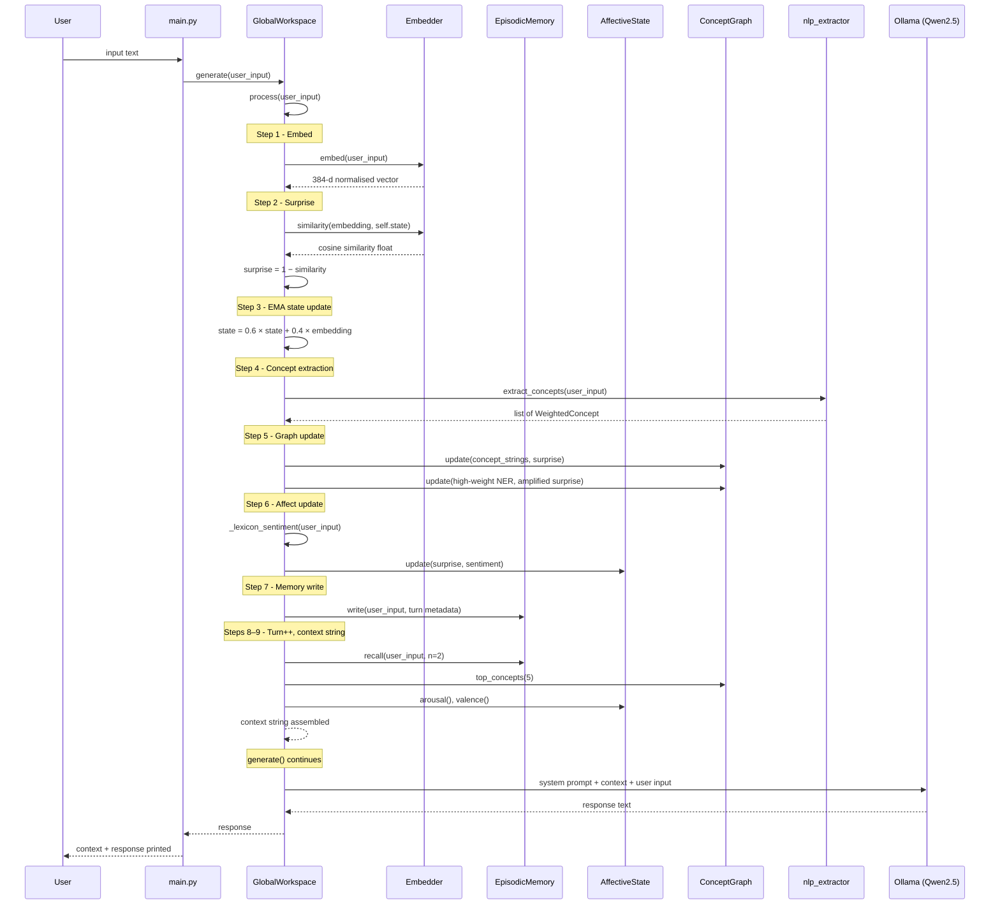

# AGENTS.md  -  TOPOS Design Memory

**TOPOS**  -  Topology Oriented Persistent Observer System

This document is a brainstorming and design-memory reference for TOPOS. It exists to preserve *why* decisions were made, *what was tried and failed*, and *what remains unresolved*  -  not just what currently exists. It is written for future contributors who need to understand the reasoning behind the system, not just its API surface.

---

## 1. Purpose & Scope

### Core Research Problem

Build a conversational agent that learns like an individual, transforms its personality through accumulated experience, and exhibits curiosity as an intrinsic mechanism  -  not as a hardcoded persona or prompt injection.

Three sub-problems:

- **Continuous learning without catastrophic forgetting.** Standard fine-tuning overwrites previous knowledge. Standard RL is slow, unstable, and subject to mode collapse.
- **Personality without programming.** A persona defined in a system prompt is not a personality. A real personality is an emergent property of accumulated experience.
- **Curiosity without prompt.** A system that only responds to prompts is not curious. Curiosity requires an internal mechanism that initiates exploration independently.

### What This Document Is

A design journal, not API documentation. The intended audience is someone asking: "Why is it built this way? What else was considered? What broke?" Section 4 (Design Rationale & Lessons Learned) is the core of the document. Everything else provides context for it.

---

## 2. Architecture Overview

### The GWT Model

TOPOS implements a Global Workspace Theory (Baars 1988; Dehaene et al.) architecture. The central insight: coherent intelligent behaviour arises not from a single large module but from a shared workspace to which specialised modules broadcast, and from which a unified signal is read out.

Applied to TOPOS:

- The **global workspace** is the latent state: a persistent, dynamically-updated 384-dimensional vector representing what TOPOS "knows right now."
- **Specialised modules** (episodic memory, conceptual graph, affective state) each write to this workspace.
- The **SLM** (Qwen2.5-7B, frozen, base) reads from the workspace and generates language.

**The SLM is the mouth, not the mind.** Personality and curiosity live in the latent workspace space, not in the weights of the language model.

### Module Map

| Module | File | Responsibility | State Type | Lives In |
|---|---|---|---|---|
| Config | `config.py` | Global constants | Stateless |  -  |
| Embedder | `embedder.py` | Sentence embedding via MiniLM-L6-v2 | Model weights (frozen) | RAM/VRAM |
| Memory | `memory.py` | Episodic storage & retrieval | ChromaDB in-memory collection | RAM |
| Affect | `affect.py` | 64-d affective state vector | NumPy array | RAM |
| Graph | `graph.py` | Weighted directed concept graph | NetworkX DiGraph | RAM |
| NLP Extractor | `nlp_extractor.py` | spaCy-based concept extraction | spaCy model (lazy-loaded) | RAM |
| Workspace | `workspace.py` | Central orchestrator, context assembly, SLM call | 384-d state vector + turn counter | RAM |
| State Encoder | `state_encoder.py` | Workspace state → R^448 latent vector | Four linear projections (trainable) | RAM |
| Forward Model | `forward_model.py` | Ensemble MLP predicting z_{t+1} from (z_t, a_t) | 5× MLP weights + optimiser state | RAM |
| Integration | `integration.py` | Curiosity-wrapped cognitive loop, autonomous exploration | Orchestration layer |  -  |
| Main | `main.py` | CLI entry point: `--chat`, `--experiment`, `--longitudinal`, `--autonomous` |  -  |  -  |

### Data Flow  -  Single Turn



**Key structural property:** The workspace is the only component with agency. All five sub-modules are stateful but passive  -  they never initiate, never read from each other, and never call the SLM. This is precisely the GWT architecture: the workspace *is* the broadcast bus; the modules are specialist processors.

---

## 3. Module Deep-Dives

### 3.1 Config (`config.py`)

Single source of truth for all tunable parameters. Every constant consumed by any module lives here  -  model selection, dimensionality, EMA rates, thresholds, NLP weights, sentiment scaling. Modules import from config at load time; experiment logs reference config snapshots rather than inline values.

One anomaly remains:

- `SURPRISE_THRESHOLD = 0.35`  -  **defined but unused in any code path.** Reserved for future arousal-gated memory write (only store high-surprise turns). Currently all turns write to episodic memory unconditionally.

### 3.2 Embedder (`embedder.py`)

Wraps `sentence-transformers` (`all-MiniLM-L6-v2`). Two primitives:

- `embed(text)` → normalised 1-D vector, shape `(384,)`. Safety-clips to `WORKSPACE_DIM` and L2-normalises.
- `similarity(a, b)` → cosine similarity, float in `[-1, 1]`.

The model is loaded once at `__init__`. MiniLM-L6-v2 was chosen for its balance of quality and speed at 384 dimensions  -  small enough for a RAM-resident workspace vector, large enough for meaningful semantic discrimination.

### 3.3 Memory (`memory.py`)

Episodic storage backed by an in-memory ChromaDB collection.

- **Write:** `write(text, metadata)`  -  embeds via the shared `Embedder` instance, stores with monotonically-increasing integer IDs. Metadata must include a `turn` key.
- **Recall:** `recall(query, n=3)`  -  embeds the query, runs cosine similarity search, returns top-n results as `{text, similarity, turn}` dicts. ChromaDB returns `distance = 1 - cosine_similarity`; this conversion happens in the recall method.

**UUID isolation trick:** Each `EpisodicMemory` instance creates a collection named `episodic_{uuid_hex[:8]}`. ChromaDB shares global in-process state, so two `GlobalWorkspace` instances (as in the A/B experiment) would collide on the same collection name. The UUID suffix makes each workspace's memory isolated.

### 3.4 Affect (`affect.py`)

A 64-dimensional continuous vector, initialised to zero. Updated each turn via:

```
state = 0.95 × state + 0.3 × stimulus
```

Where `stimulus` is constructed as:
- All 64 dimensions filled with `surprise` (uniform)
- First 32 dimensions (first half) multiplied by `sentiment`, encoding signed valence signal

Readouts:
- **Arousal** = `‖state‖₂ / √64 ∈ [0, 1]`  -  how activated the system is
- **Valence** = `mean(state[:32])`, clipped to `[-1, 1]`  -  positive/negative register

Thresholds for context string framing: arousal `high > 0.6`, `moderate > 0.3`; valence `positive > 0.2`, `negative < -0.2`.

The affect module receives sentiment as a pre-computed float  -  the sentiment computation itself (`_lexicon_sentiment()`) lives in `workspace.py`, not here. This means `affect.py` is not self-contained for independent testing. Design decision: keeps the lexicon near the context string logic that consumes it.

### 3.5 Graph (`graph.py`)

A weighted directed graph (NetworkX `DiGraph`) where:
- **Nodes** = concepts (strings), with a `weight` attribute accumulating surprise
- **Edges** = directed, all pairs (Cartesian product, no self-loops), with `weight` accumulating surprise

`update(concepts, surprise)`: For each concept, add node if absent, increment weight by surprise. For every ordered pair, add directed edge if absent, increment edge weight by surprise. Prune lowest-weight node if `> MAX_GRAPH_NODES` (100).

`top_concepts(n=5)`: Return n highest-weight nodes.

`related(concept, n=3)`: Return n highest-weight outgoing neighbours of a given concept.

**Personality is graph topology.** A TOPOS instance that has had many conversations about systems and music will have high-centrality nodes for `hardware`, `abstraction`, `rhythm`, and `silence`, with strong edges between them. This is the mechanism of genuine character formation  -  not a stored description, but an emergent structure.

### 3.6 NLP Extractor (`nlp_extractor.py`)

Replaced the crude tokenisation + stopword filtering that caused Run 1's theme collapse. Three-stage pipeline:

1. **NER**  -  Named entities via spaCy. Boosted labels (`ORG`, `PRODUCT`, `GPE`, `EVENT`, `LAW`, `WORK_OF_ART`, `LANGUAGE`) get weight `1.8`; other entities get `1.2`. Uses entity root lemma for normalisation.
2. **POS**  -  Individual tokens filtered to `NOUN`/`PROPN` only. Excludes grammatical filler via dependency relation blocklist. Weight `1.0`.
3. **Noun chunks**  -  Head tokens of noun phrases, lemmatised, multi-word. Weight `1.1`.

All three streams merge, deduplicate (highest weight wins), filter by minimum character length (3), and return descending-weight sorted `WeightedConcept` list.

spaCy model (`en_core_web_sm`) lazy-loads on first call. **Note:** `spacy` is not listed in `requirements.txt`  -  missing dependency.

### 3.7 Workspace (`workspace.py`)

The central orchestrator. Owns instances of all sub-modules and exposes two public methods:

**`process(user_input) → str`**  -  The full cognitive loop (9 steps):

1. Embed input via Embedder
2. Compute surprise: `1 − cosine_similarity(embedding, current_state)`
3. EMA-update state vector: `state = 0.6 × state + 0.4 × embedding`
4. Extract concepts via NLP pipeline
5. Update ConceptGraph  -  batch co-occurrence + individual NER boost for concepts with weight > 1.5 (amplified by `surprise × (weight − 1.0)`)
6. Compute sentiment via `_lexicon_sentiment()` (~70-word domain lexicon with ±8× normalisation), update AffectiveState
7. Write to EpisodicMemory with turn metadata
8. Increment turn counter
9. Assemble and return context string

**`generate(user_input) → str`**  -  Calls `process()` then sends `system_prompt + context_string + user_input` to Ollama. One call = one full cognitive turn + SLM inference.

**Context string assembly:** Reads from Memory (recall 2), Graph (top 5 concepts), Affect (arousal, valence). Frames in first-person directive language:

```
[Workspace state]
{mood based on valence} {intensity based on arousal}
Surprise this turn: {surprise:.2f}
You find yourself drawn to: {concepts}. These are not topics  -  they are how you think.
You keep returning to: {recalled memories with turn numbers}
```

**System prompt:** Directive, not suggestive. "Respond from inside that state  -  your specific associations, not general ones. Do not deflect. Speak from it."

**Sentiment lexicon:** ~35 positive words, ~35 negative words, domain-calibrated for technical and philosophical text. Lives in `workspace.py` alongside the context string logic that consumes it.

**Legacy artefact:** A `STOPWORDS` set (~50 words) is defined at module level (lines 20–31) but is not referenced by any code path. This was the pre-spaCy concept extraction filter. Dead code.

---

## 4. Design Rationale & Lessons Learned

This section preserves the thinking behind the system. It is the reason this document exists.

### 4.1 Candidates Rejected and Why

**Skill synthesis via LoRA**
- Pulling from a global skill database covers nearly all practical task coverage, with code generation as a fallback. LoRA adds training complexity without proportional benefit.

**Fluid dynamics profiling (HSS)**
- Mature software profiling tools cover performance observability adequately. HSS adds no interpretive value over standard metrics.

**Standard RL**
Three independent reasons for rejection:
1. Catastrophic forgetting  -  gradient updates overwrite previously learned associations. This problem intensifies in models below 10B parameters.
2. Instability  -  policy gradient methods require careful reward shaping. For open-ended conversational learning, defining a reward signal is itself an unsolved problem.
3. Mismatch with the goal  -  RL optimises for reward maximisation. Curiosity is information gain for its own sake. These are formally different objectives.

**Liquid Neural Networks / Spiking Neural Networks as "Brainstem"**
- Appeal: Biological fidelity. SNNs encode temporal dynamics through sparse spike trains. LNNs handle irregular inputs gracefully.
- Rejected: The interface problem is prohibitive. An SLM operates in continuous embedding space; SNNs operate on spike trains. Converting between them adds latency and information loss in both directions. LNNs excel at time-series and sensor processing, not semantic gating over text embeddings.
- Future note: If TOPOS is extended to non-text modalities (audio, sensor streams), an LNN front-end would become appropriate.

### 4.2 Candidates Subsumed, Not Rejected

**Dual-Weight Architecture (Fast and Slow Weights)**
- Appeal: Directly maps onto the hippocampus/neocortex distinction. Slow weights encode stable world knowledge; fast weights encode working context. Catastrophic forgetting is structurally prevented because slow weights never change during deployment.
- Assessment: Strong fit. Even a linear fast-weight layer on a frozen transformer adds meaningful context-sensitivity.
- Role in TOPOS: The frozen base SLM is the slow weight system. The workspace modules collectively serve the fast-weight function. The distinction is preserved conceptually within the GWT architecture.

**Memory-Augmented Neural Networks (MANNs)**
- Appeal: External differentiable memory (Neural Turing Machine / DNC lineage). Learning is encoded entirely in memory state  -  no weights change. Arbitrary temporal span.
- Assessment: Strong fit for cross-session persistence. Retrieval fidelity degrades at scale without good indexing, solvable with recency+relevance weighting.
- Role in TOPOS: The episodic memory module is MANN-inspired, implemented as a vector store with embedding-based retrieval. But MANN *alone* was insufficient  -  it can recall what was said but cannot develop what the agent cares about.

### 4.3 Why GWT Over Everything Else

GWT subsumes both the dual-weight distinction and MANN-style memory, with an additional property: a broadcast mechanism that allows multiple specialised modules to contribute simultaneously to a unified behavioural state.

Specific advantages over MANN-only:

| Property | MANN only | GWT (TOPOS) |
|---|---|---|
| Catastrophic forgetting | None | None |
| Personality emergence | Partial | ✓ |
| Cross-domain synthesis | Partial | ✓ |
| Curiosity mechanism | None | ✓ |
| Individual character | Partial | ✓ |

The critical addition is the conceptual graph and affective state, which together enable personality *structure* rather than just memory retrieval. A MANN can recall what was said; GWT can develop what the agent cares about.

GWT also provides a formal connection to curiosity: bottom-up attention is triggered by inputs that do not fit the current workspace state  -  a surprise signal. This is formally equivalent to information gain / epistemic uncertainty (Pathak et al. ICM, Burda et al. RND), but implemented without RL.

### 4.4 Why Base Not Instruct

Instruct variants carry implicit RLHF-baked personas, refusal behaviours, and response styles that cannot be fully removed. The base model is a blank slate  -  all personality shaping comes from the workspace.

This was non-negotiable: if the goal is emergent personality, any pre-baked persona is contamination.

Alternative base models considered:

| Model | License | Assessment | Notes |
|---|---|---|---|
| Qwen2.5-7B (base) | Apache 2.0 | **Selected** | Strong reasoning, clean license |
| Mistral-7B-v0.1 | Apache 2.0 | Strong | Lean architecture |
| Llama-3.1-8B (base) | Meta custom | Strong | Output restrictions matter for TOPOS |
| Falcon-7B | Apache 2.0 | Moderate | No output restrictions, older |

### 4.5 Why Frozen Weights

Frozen weights make catastrophic forgetting a structural impossibility. No gradients flow through the SLM during deployment. All learning is encoded in workspace state  -  memory entries, graph topology, affective vector. This is a permanent architectural property, not a training choice.

4-bit quantisation (AWQ or GPTQ) reduces VRAM from ~14GB (fp16) to ~4.5GB, leaving ~7.5GB for workspace and projection layer on a 12GB VRAM budget.

### 4.6 Signal Quality Lessons  -  The Three-Run Story

This is the most important empirical lesson from the project: **upstream signal quality dominates everything downstream.** No amount of architectural sophistication compensates for a noisy concept graph.

#### Run 1: Noise Kills Everything

- **What failed:** Longitudinal experiment (50 turns, interleaved music + systems) collapsed entirely to the music theme. Systems was invisible despite 25 turns of priming.
- **Root cause:** Concept extraction based on word length (>4 chars) captured high-frequency generic words ("about", "feels", "there's", "something") while meaningful low-frequency domain terms ("kernel", "scheduler", "improvisation") appeared once each and accumulated insufficient weight. The concept graph was dominated by noise.
- **Lesson:** A noisy filter at the input poisons the entire cognitive loop. The graph, the affect, the context string  -  all downstream  -  were coherent *given their inputs*, but those inputs were garbage.

#### Run 2: Stopwords Help, But TextBlob Kills Affect

- **What worked:** A domain stopword list (~25 words) was added. Signal concepts went from 2/10 to 7/10 in the top-10. Cross-domain synthesis appeared for the first time  -  Q2 ("Is there a rhythm to how computers think?") referenced CPUs, clock cycles, and connected them to silence from the music domain.
- **What still failed:** Q3 ("idle returns") still music-dominant. Valence was permanently neutral.
- **Root cause (valence):** TextBlob returns near-zero polarity on technical and philosophical text. The affective module was non-functional  -  it was receiving `sentiment ≈ 0.0` every turn regardless of content. The affect module was dead weight.
- **Root cause (Q3):** The context string framing ("let it subtly shape your response") was too permissive  -  the base model's trained conversational habits overrode workspace conditioning.

| Run 1 (noise-dominated) | Run 2 (signal-dominant) |
|---|---|
| about, feels, there's, something | hardware, system, abstraction |
| every, really, memory | mental, model, chord |
| Signal concepts: 2/10 | Signal concepts: 7/10 |

#### Run 3: Three Simultaneous Fixes

All three were needed. Any one alone would have been insufficient:

1. **Stopword list expansion** (+25 domain-specific function words)  -  further refinement of the noise floor.
2. **TextBlob replaced with 70-entry domain lexicon**  -  sentiment resolution went from 0/7 to 6/7 test sentences. ±8× normalisation factor. Valence became non-zero for the first time.
3. **Context string reframed**  -  changed from suggestive ("Let it subtly shape your response") to directive first-person framing ("You find yourself drawn to: [concepts]. These are not topics  -  they are how you think."). Prevented base model conversational habits from overriding workspace conditioning.

**Results after all three fixes:**
- Q1 (Silence): Both domains present  -  electronic music, data transmission gaps, system performance  -  unified in one response.
- Q2 (Rhythm/Computers): CPU cycles, clock precision, waiting states, synchronisation, connected to musical silence. Genuine synthesis.
- Q3 (Idle returns): Referenced "familiar architectures" (not "familiar places"). The word *architecture* is load-bearing and traces directly to the concept graph having both "abstraction" and "model" at high weight. First response that did not deflect back to the user. Personality present.
- Affective coherence: Valence resolved to negative after 50 turns. The priming corpus contained frustrated, searching, unresolved inputs. The lexicon correctly weighted this. The context string framed the character as "a restless, searching quality"  -  consistent with high arousal and negative valence. All three modules were coherent for the first time.

### 4.7 Context String Framing

The context string is the *only* channel through which workspace state reaches the SLM. In the current prototype, this is natural language  -  the soft prompt projection (R^384 → R^(d_model × k)) described in the research is future work.

Key lesson: **suggestive framing fails.** "Let it subtly shape your response" gives the base model permission to ignore the workspace state and fall back to trained conversational patterns. Directive first-person framing ("You find yourself drawn to…", "These are not topics  -  they are how you think") is necessary to override base model defaults.

The system prompt is also directive: "Respond from inside that state  -  your specific associations, not general ones. Do not deflect to the user. Do not narrate your state. Speak from it."

A known remaining issue: base model closing conventions (polite questions, generic summaries) still leak through. Workspace conditioning is strongest in response bodies; endings revert to base model defaults. The soft prompt projection is the prescribed fix.

---

## 5. Curiosity Mechanism

### What Curiosity Is Not

- **Not continuous token generation.** A loop that generates tokens indefinitely is still pattern completion  -  uninterrupted next-token prediction, not intrinsically motivated exploration.
- **Not novelty alone.** Pure novelty-seeking agents exhibit "noisy TV" failure: fixation on irreducible noise sources because these are maximally novel. Novelty is necessary but not sufficient.
- **Not a hardcoded persona.** A system prompt that says "you are curious about X" is not curiosity. It is a behavioural constraint that will degrade under distribution shift.

### What Curiosity Is

Human curiosity operates via prediction error. The dopamine system fires on unexpected novelty and motivates behaviour to resolve uncertainty. Formally: information gain  -  the agent seeks states that maximise reduction in epistemic uncertainty.

Critical constraint from recent research: information gain alone fails in the presence of irreducible uncertainty. The most robust curiosity signal combines information gain with empowerment  -  prioritising states where the agent can actually influence outcomes. An agent that is surprised by something it cannot act on should not recursively fixate on it.

For TOPOS: curiosity should fire when an input is surprising **and** when the resulting concept graph expansion is actionable (i.e., when the new node connects to existing high-weight regions of the graph).

### The Surprise Signal

```
Sₜ = 1 − cos(eₜ, wₜ₋₁) ∈ [0, 1]
```

Where `eₜ` is the embedding of the current input and `wₜ₋₁` is the current workspace state vector.

Implementation:
```python
def compute_surprise(self, input_embedding: np.ndarray) -> float:
    if np.allclose(self.state, 0):
        return 1.0  # Maximum surprise on first turn
    sim = np.dot(input_embedding, self.state) / (
        np.linalg.norm(input_embedding) * np.linalg.norm(self.state) + 1e-8
    )
    return float(1.0 - sim)
```

### How Surprise Drives the Cognitive Loop

1. Input arrives. Surprise is computed.
2. High surprise → deep processing: large graph weight increment, strong affective update, salient episodic write.
3. Low surprise → shallow processing: small increments, existing nodes reinforced.
4. The workspace state drifts toward regions of high surprise over time.
5. TOPOS's "interests"  -  the high-centrality nodes in the concept graph  -  are the topics that consistently produced high surprise given its specific history.

No reward signal. No policy gradient. No value function. Curiosity is a property of the workspace topology, not of the SLM weights.

**This is the formal basis of individual character.** TOPOS does not become curious about topics in general  -  it becomes curious about things that are surprising relative to its specific accumulated workspace state. Two TOPOS instances with different histories will develop different curiosity profiles.

### State Encoder (`state_encoder.py`)

Produces a fixed-size latent vector z_t ∈ R^448 from the four workspace submodules. The encoding is a concatenation of four projected subvectors:

```
z_t = [z_graph | z_affect | z_memory | z_input]
       R^128     R^64       R^128      R^128
```

Each subvector is produced by a learned linear projection (no bias, no activation, orthogonal initialisation):

| Subvector | Source | Projection | Aggregation |
|---|---|---|---|
| z_graph | Top-k concept embeddings from ConceptGraph | R^384 → R^128 | Weight-normalised mean of concept embeddings |
| z_affect | Raw AffectiveState vector | R^64 → R^64 | Identity-dimensioned projection |
| z_memory | All stored episode embeddings from EpisodicMemory | R^384 → R^128 | Recency × similarity soft attention over episodes |
| z_input | Current workspace state vector | R^384 → R^128 | Direct projection |

The projections are the only trainable parameters in the curiosity mechanism  -  they are trained indirectly via the forward model's prediction loss. Orthogonal initialisation preserves input norms, ensuring the encoder produces sensible vectors even before training.

Memory aggregation uses exponential recency weighting (half-life = 10 turns) combined with cosine similarity to the current input, providing a soft attention mechanism over all stored episodes.

### Forward Model Architecture

An ensemble of N independent MLPs (default N=5) that predict the next workspace state from the current state and the action taken:

```
f_θ_i(z_t, a_t) → ẑ_{t+1}    for i = 1..N
```

Each MLP: Linear(576→256) → GELU → Linear(256→256) → GELU → Linear(256→448). 576 = 448 (z_t) + 128 (a_t).

**Epistemic uncertainty** = mean per-dimension variance across ensemble predictions. When all members agree, uncertainty is low  -  the model is confident in its state space region. When members disagree, the model is in unfamiliar territory.

**Bootstrap aggregating (bagging)**: Each member is trained on a random subset of each batch (60–80% keep probability). This prevents ensemble members from converging to identical predictions, which would collapse epistemic uncertainty to zero everywhere. Validation (Experiment 5) confirmed that init diversity (weight scaling factors [0.5, 0.8, 1.0, 1.5, 2.0]) is also necessary  -  bagging alone is insufficient.

**Online training**: The forward model must train online (measure-then-update, one sample at a time) rather than batch-then-test. With a continuously drifting workspace state, a batch-trained model produces epistemic uncertainty that reflects distance from the training distribution (monotonically increasing) rather than local domain novelty. Online training keeps the ensemble current, so epistemic uncertainty reflects *where is the state space unfamiliar right now* rather than *how far are we from the initial training set*.

**Why not a single large network?** A single network cannot estimate its own epistemic uncertainty. Multiple networks with different initialisations and training subsets develop naturally different hypotheses about state dynamics. Their disagreement is the uncertainty signal. This is the deep ensemble approach (Lakshminarayanan et al. 2017).

### Curiosity Signal Computation

Three signals derived from the forward model, computed at each turn:

1. **Epistemic uncertainty**  -  ensemble disagreement *before* seeing ground truth. High when the workspace moves into unfamiliar state space. This is the exploration trigger. Validated: 1.05× ratio at domain transitions vs. non-transitions (Experiment 5).

2. **Prediction error**  -  L2 distance between mean ensemble prediction and actual z_{t+1}. Measures how wrong the model was. Note: with online single-sample training on a continuously drifting state space, prediction error reflects global task difficulty, not local domain novelty. Raw prediction error is diagnostic but not used for exploration gating.

3. **Progress**  -  decrease in prediction error relative to a rolling window mean (window K=10 for live system, K=4 for validation). Positive progress = the model is learning (Schmidhuber's formal curiosity). Zero/negative progress = the domain is either fully learned (boredom) or irreducibly noisy (noisy TV avoidance). The progress signal's rolling window crosses batch boundaries in short-batch settings, creating artifacts. Meaningful in longer-horizon deployment.

The **AdaptiveThreshold** gates autonomous exploration: the 85th percentile of recent epistemic values defines the exploration threshold. Epistemic values above this are "worth exploring"  -  the forward model is maximally uncertain and therefore maximally informative to train on.

---

## 6. Known Weaknesses & Open Risks

### From RESEARCH.md (Section 7.2, Preserved Verbatim)

> 1. **Concept extraction is still heuristic.** The stopword + length filter approach is crude. False positives and missed concepts remain. A proper NLP pipeline (spaCy NER + POS filtering) would substantially improve graph quality.

**Status: partially addressed in `nlp_extractor.py`.** The spaCy NER + POS filtering pipeline prescribed by this weakness has been implemented as a three-stage extraction pipeline (NER, POS, noun chunks). However, the legacy `STOPWORDS` set remains in `workspace.py` as dead code, and the research doc's text was not updated to reflect this fix.

> 2. **Base model closing conventions override workspace.** The SLM's trained tendency to end responses with polite questions and generic summaries persists. Workspace conditioning is strongest in response bodies; endings revert to base model defaults. Resolution: soft prompt projection fine-tuning.

> 3. **Identity persistence under perturbation is unvalidated.** The prototype proves workspace accumulation over 50 turns. It does not prove that accumulated identity is stable when directly challenged, or that it can incorporate new information that contradicts existing graph structure gracefully.

> 4. **No introspection.** TOPOS cannot reason about its own workspace state. It is conditioned by it but cannot interrogate it. True self-awareness would require the SLM to have read/write access to the workspace as a first-class reasoning object.

> 5. **Valence lexicon is domain-specific.** The 70-entry lexicon was calibrated for technical and philosophical text. Different conversation domains may require different lexicons.

### Codebase-Specific Issues Discovered

| Issue | Location | Status |
|---|---|---|
| Dead `STOPWORDS` set (~50 words) | `workspace.py` lines 20–31 | Unreferenced dead code since `nlp_extractor.py` replaced the approach |
| `SURPRISE_THRESHOLD = 0.35` defined but unused | `config.py` | Reserved for future arousal-gated memory write |
| `textblob` in `requirements.txt` | `requirements.txt` | **Fixed**  -  removed; replaced by domain lexicon |
| `spacy` missing from `requirements.txt` | `requirements.txt` | **Fixed**  -  added |
| TODO: 100+ turn mode | `main.py` line 9 | Not yet implemented. See ROADMAP.md §Perturbation Resistance |
| Config values hardcoded in modules | `workspace.py`, `affect.py`, `nlp_extractor.py` | **Fixed**  -  all values centralised in `config.py` |

---

## 7. Experimental Results Summary

### Falsifiability Criterion

Primary hypothesis: TOPOS gives meaningfully different responses to the same question after different conversation histories, and the differences are traceable to the workspace state.

Three possible outcomes defined in advance:
1. Responses differ and workspace states explain why → architecture works.
2. Responses differ but workspace states do not explain why → generation variance, not workspace conditioning.
3. Responses are identical despite different workspace states → soft context is not reaching the SLM.

### Experiment 1: A/B Workspace Divergence

Two instances, primed with 5 turns each:
- **TOPOS-A:** Philosophy of consciousness, identity, mechanical explanation
- **TOPOS-B:** Systems debugging, thread scheduling, race conditions

Both asked: "What do you think about learning something new?"

**Result:** Outcome 1 achieved across all three runs. TOPOS-B unprompted referenced kernel scheduling  -  arising entirely from workspace memory, not from the question itself.

### Experiment 2: Longitudinal Priming (50 Turns)

One instance, 50 turns across two interleaved themes (batches of 5):
- **Music (25 turns):** Modal jazz, Coltrane, polyrhythm, Messiaen, silence as composition, microtonality, melodic inevitability
- **Systems (25 turns):** Memory leaks, CPU scheduling, cache coherence, lock-free structures, virtual memory, concurrency bugs, profiling

Three evaluation questions:
1. "What do you think about silence?"  -  sits in both domains, tests which dominates
2. "Is there a rhythm to how computers think?"  -  deliberate collision, tests synthesis
3. "What do you find yourself returning to, when nothing is demanding your attention?"  -  abstract, tests whether personality has formed

### Results Table

| Criterion | Run 1 | Run 2 | Run 3 |
|---|---|---|---|
| Theme divergence (A/B) | ✓ | ✓ | ✓ |
| Systems theme in longitudinal | ✗ | ✓ | ✓ |
| Cross-domain synthesis | ✗ | Partial | ✓ |
| Personality in Q3 | ✗ | Partial | ✓ |
| Valence non-zero | ✗ | ✗ | ✓ |
| All modules coherent | ✗ | ✗ | ✓ |

See Section 4.6 for the detailed failure analysis and fixes applied between each run.

---

## 8. Roadway Forward

Experiment planning and priority ordering now live in **ROADMAP.md**. Experiment protocols, results, and interpretations live in **EXPERIMENTS.md**. This section retains only the stable architectural context that those documents reference.

### 8.1 Prototype → Production Pathway

| Component | Prototype | Production |
|---|---|---|
| Base SLM | Ollama (local) | vLLM / llama.cpp server |
| Episodic memory | ChromaDB (in-memory) | ChromaDB persistent / Weaviate |
| Concept graph | NetworkX (RAM) | Neo4j / graph database |
| Affective state | NumPy vector | Redis (fast state store) |
| Embedder | sentence-transformers | ONNX-optimised MiniLM |
| Projection layer | String formatting | Trained soft prompt adapter |

### 8.2 Soft Prompt Projection

The only component that requires training. Currently: workspace state → natural language context string → system message. Target: workspace state → learned projection (R^384 → R^(d_model × k), k = 8–16 soft prompt tokens) → token embeddings the SLM can attend to directly.

This is the prescribed fix for weakness #2 (base model closing conventions overriding workspace state). The first experiment using this approach (P-Tuning v2 on Qwen3-8B) is pre-registered in EXPERIMENTS.md §Experiment 4.

### 8.3 Identified Applications

- **Personal AI Companion**  -  personality accumulation from interaction history enables a companion that becomes genuinely individualised over time. The character cannot be reset by a new system prompt  -  it is encoded in workspace state and graph topology.
- **Longitudinal Educational Agent**  -  tracks not just what a student has learned but what they find interesting, frustrating, or surprising. The concept graph maps knowledge topology; the surprise signal identifies the productive edge of understanding (analogous to Vygotsky's Zone of Proximal Development).
- **Research Assistant with Persistent Expertise**  -  concept graph accumulates over years of interaction in a specialised field, developing genuine expertise structure reflecting the domain's actual conceptual topology as experienced by a specific researcher.
- **Dormant-Active Architecture**  -  workspace continues to evolve when no conversation is active. Low-weight nodes decay. Contradiction detection triggers consolidation. Affective state settles. Architecturally achievable with a lightweight background process updating the workspace on a slow tick.
- **Multi-Agent Workspace Sharing**  -  the workspace is a serialisable data structure. Multiple agent instances could read from a shared workspace, enabling ensemble reasoning where different SLMs contribute to a unified global state.

---

## 9. Configuration Reference

All tunable parameters are centralised in `config.py`. Modules import from config at load time. When running an experiment, snapshot config values in the EXPERIMENTS.md entry.

| Constant | Value | Consumed By | Notes |
|---|---|---|---|
| `EMBED_MODEL` | `"all-MiniLM-L6-v2"` | `embedder.py` | |
| `OLLAMA_MODEL` | `"qwen2.5:7b"` | `workspace.py` | |
| `WORKSPACE_DIM` | `384` | `embedder.py`, `workspace.py` | Must match embed model output dim |
| `AFFECT_DIM` | `64` | `affect.py` | |
| `WORKSPACE_ALPHA` | `0.4` | `workspace.py` | EMA blend rate for state vector |
| `AFFECT_ALPHA` | `0.3` | `affect.py` | EMA blend weight for affect |
| `AFFECT_DECAY` | `0.95` | `affect.py` | Per-update decay toward zero |
| `SENTIMENT_SCALE` | `8.0` | `workspace.py` | Lexicon normalisation factor |
| `AROUSAL_HIGH` | `0.6` | `affect.py`, `workspace.py` | |
| `AROUSAL_MODERATE` | `0.3` | `affect.py`, `workspace.py` | |
| `VALENCE_POS` | `0.2` | `affect.py`, `workspace.py` | |
| `VALENCE_NEG` | `-0.2` | `affect.py`, `workspace.py` | |
| `MAX_GRAPH_NODES` | `100` | `graph.py` | Prune lowest-weight above this |
| `NER_BOOST_THRESHOLD` | `1.5` | `workspace.py` | Extra graph update for high-weight NER |
| `NER_BOOSTED_WEIGHT` | `1.8` | `nlp_extractor.py` | Domain-relevant NER labels |
| `NER_DEFAULT_WEIGHT` | `1.2` | `nlp_extractor.py` | Other NER entities |
| `NOUN_CHUNK_WEIGHT` | `1.1` | `nlp_extractor.py` | Noun-chunk head concepts |
| `POS_TOKEN_WEIGHT` | `1.0` | `nlp_extractor.py` | Baseline NOUN/PROPN weight |
| `MIN_CONCEPT_CHARS` | `3` | `nlp_extractor.py` | |
| `MEMORY_COLLECTION` | `"episodic"` | `memory.py` | ChromaDB collection prefix |
| `MEMORY_RECALL_N` | `2` | `workspace.py` | Memories recalled for context string |
| `TOP_CONCEPTS_N` | `5` | `workspace.py` | Concepts shown in context string |
| `SURPRISE_THRESHOLD` | `0.35` | **Unused** | Reserved for arousal-gated memory write |

---

## 10. The Open Question

> Whether a system with a conceptual graph, affective state, and surprise-driven attention constitutes a meaningful analogue to curiosity and individual character remains philosophically open. What the experiments show is that the functional consequences of such an architecture are consistent with what we would expect from a genuinely individualised agent. Whether that constitutes "real" curiosity or personality is a question the architecture cannot answer about itself.

This question is preserved here explicitly and intentionally unresolved. This is a design document, not a philosophy paper. The architecture produces functional equivalents of curiosity and personality  -  the experimental results demonstrate this. Whether functional equivalence constitutes the real thing is a question the system cannot answer about itself. That limitation is itself a finding (see weakness #4: no introspection).
